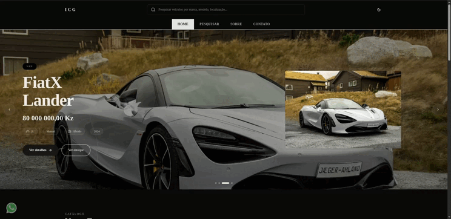
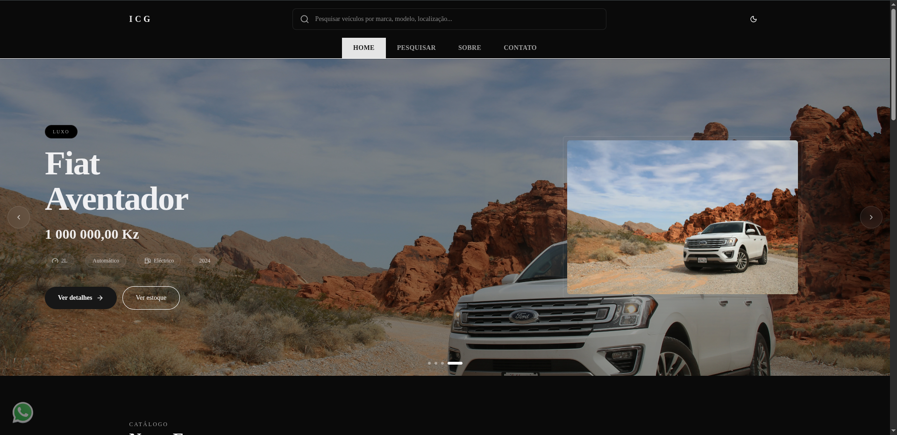
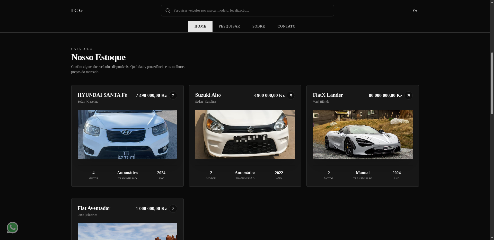

# ICG — International Car Group

A ICG — International Car Group é uma referência em Luanda na importação e venda de veículos premium. Cada unidade é seleccionada, inspeccionada e preparada com o cuidado que distingue um verdadeiro showroom.

---

## Preview



---

## Screenshots





---

## Sobre o Projeto

Este projeto utiliza majoritariamente **TypeScript** (98.4%) e **CSS** (1.6%) para entregar uma experiência web moderna.

## Iniciando o Projeto

1. Instale as dependências:

```bash
npm install
```

2. Rode o servidor de desenvolvimento:

```bash
npm run dev
```

Acesse [http://localhost:3000](http://localhost:3000) no seu navegador para visualizar a aplicação.

## Estrutura

- O desenvolvimento principal ocorre em `app/page.tsx`.
- O projeto é baseado em Next.js, proporcionando otimização automática e performance.

## Contato

Dúvidas ou sugestões? Entre em contato através do [GitHub Issues](https://github.com/xmaj2001/ICG/issues).
